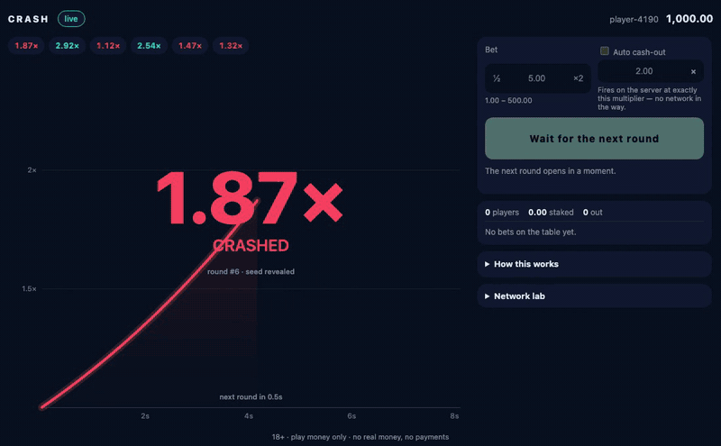

<div align="center">

# Crash

**A real-time multiplayer crash game — one round, every player in it at once, a multiplier that
climbs until it busts at a point fixed before anyone bet. Node + TypeScript server, Canvas 2D
client, one WebSocket between them, and a verifier that lets a stranger check any round in the
browser.**

[](https://github.com/KuliyevMerdan/crash/actions/workflows/ci.yml)




### [▶ Play the live demo](https://crash-demo-ut88.onrender.com/) · [Verify the latest round](https://crash-demo-ut88.onrender.com/#/verify/latest)

**18+ · Demo · Play money only — no real money, no payments, no crypto.**

</div>

> **[crash-demo-ut88.onrender.com](https://crash-demo-ut88.onrender.com/)** runs on a free tier that sleeps
> after 15 idle minutes: the first visit after a quiet spell takes about a minute to wake it, and
> every wake is a fresh table — a new chain, new play-money wallets ([ADR-0003](docs/adr/ADR-0003-demo-host.md)).
>
> Or run the same image locally:
>
> ```bash
> docker build -t crash . && docker run --rm -p 8080:8080 -e CRASH_FAULTS=on crash
> ```

## Two minutes with the demo

1. **Bet, and watch the button.** While the round runs, the cash-out button shows what your press
   will be *paid*, not what the curve shows — your press reaches the server half a round trip later,
   and the button prices that in. The result banner puts the promise beside the payout.
2. **Break your own network.** Open **Network lab** under the panel: add latency, lose packets,
   freeze the socket for 3 s or have the server drop you mid-round. Nobody else at the table is
   touched. Watch the round, your bet and your balance survive it.
3. **Check the round you just lost.** The bust banner links to the verifier: it fetches the
   revealed seed and recomputes the crash point **in your tab**, with the same code the server drew
   it with, then walks the seed back to a commit published before the first round. Every past crash
   point in the strip above the curve is such a link.

## What makes it interesting to build

Not the graphics. The synchronisation.

- **One round, shared by everyone.** The server owns the only clock that decides anything; every
  client draws the same multiplier at the same wall-clock moment. Two browsers in one round agree
  to within one hundredth, frame for frame (the E2E suite measures it).
- **The multiplier is a pure function of time**, and one implementation ships to both sides
  ([`packages/curve`](packages/curve)). So the client draws at the screen's rate from the round's
  start time alone; the server's ticks, ten a second, only catch drift. **Reconnect is trivial**:
  learn `startedAt` and the whole picture follows — there is nothing to replay.
- **Cash-out is a race against a number fixed before betting opened**, settled on the server's
  receive time — the only clock nobody can forge.
- **The network is assumed hostile.** Packet loss, frozen links, sockets that die without closing,
  reconnect storms and clocks an hour off — measured on a crowd of 500 real clients for 30 minutes
  with no money made or lost and every player in step with the server at the end.

How the pieces fit — the round loop, the clock and the diagram of why the client draws its own
curve — is in [`docs/architecture.md`](docs/architecture.md).

## The two decisions everything hangs on

**[ADR-0001](docs/adr/ADR-0001-committed-crash-point.md) — the crash point is committed before the
round and revealed after.** The server generates a hash chain — `s₀` random, each link the SHA-256
of the one before — and publishes the last link as a commit before the first round. Rounds consume
it backwards, so every revealed seed hashes to the one revealed before it, all the way back to the
commit; the crash point is a function of the seed alone, with the 1% house edge inside it as a
documented constant. No randomness runs during a round, so nothing a player does — or the house
sees — can move it. The verifier is not a re-implementation that could drift from the server: it
is the same `packages/fair`, running in the browser.

**[ADR-0002](docs/adr/ADR-0002-server-time-cashout.md) — a cash-out is worth the multiplier at the
moment the server received it, and nothing else.** Not the multiplier the client saw, not a client
timestamp: both are numbers the player's machine chose. The on-screen multiplier is a prediction;
the button shows the honest one, and **auto cash-out is the real answer to latency** — it fires on
the server at exactly its target, with no message in flight at the deciding moment. A client that
lies about its clock is paid exactly what an honest one pressing at the same moment is (tested).

## The house edge, measured

A million rounds through the real engine and the real chain (`pnpm sim -- --rounds 1000000`), one
flat-strategy player per target:

| Always cash out at | Win rate | RTP | Expected | σ | z |
| --- | ---: | ---: | ---: | ---: | ---: |
| 1.01× | 98.01% | 98.987% | 99.0% | 0.014% | −0.95 |
| 1.50× | 65.97% | 98.949% | 99.0% | 0.071% | −0.72 |
| 2.00× | 49.48% | 98.955% | 99.0% | 0.100% | −0.45 |
| 10.00× | 9.90% | 98.961% | 99.0% | 0.299% | −0.13 |
| 100.00× | 1.00% | 99.880% | 99.0% | 0.990% | 0.89 |

Every strategy returns 99% within 1σ, because `P(crash ≥ m) = 0.99 / m` for every `m` — the edge is
the same however you play. Pooled over all bets: 0.854% against 1.0% (σ 0.208%). The simulation
also found a real bug before it shipped: the engine paid an auto cash-out set exactly at the crash
point as a loss, which would have made a 1.01× strategy return 98.1% (D14 in the
[protocol](docs/protocol.md)).

## Tested rather than claimed

| What | How |
| --- | --- |
| The fairness maths | NIST and RFC 4231 vectors; 30 crash points pinned by an independent Python implementation; the chain walked to its commit |
| The round machine | 10,000 seeded rounds with money audited after every step and every bet resolved exactly once |
| Client against server | the real client against the real server in virtual time, 20 connections cut across 100 rounds |
| The screen | a forced 100× round on a 4×-throttled phone profile: 0 frames over 25 ms of 3,684, heap flat |
| The cash-out promise | 30 rounds on a 300 ms link: every manual cash-out paid exactly what the button said |
| The verifier | a stranger's lost round verified; four lying servers caught; a million-link chain walked in 1.35 s without a dropped frame |
| A hostile crowd | 500 clients, 30 minutes: slow, lossy, frozen, vanishing links, hour-off clocks, reconnect storms — 0 money breaches, 0 players out of step |
| **E2E, in CI** | Playwright: two browsers in one forced round, one cashing out and one busting, agreeing on every frame; and a stranger who bets, has the server drop them, recovers and verifies the round — the same spec runs against the live demo |

Every number above has its measurement table and the command that produced it in
[`CLAUDE.md`](CLAUDE.md) § Testing layers.

## Running it

Node ≥ 20.19 and pnpm 10.

```bash
pnpm install
pnpm dev          # server on :8080, the web app on http://localhost:5173
pnpm check        # lint, boundaries, build, typecheck, every test — what CI runs
pnpm e2e          # the Playwright suite against a local server
E2E_BASE_URL=https://crash-demo-ut88.onrender.com pnpm e2e:live   # the stranger, against any deploy
```

The browser gates (`pnpm perf:web`, `play:web`, `verify:web`), the million-round simulation
(`pnpm sim`) and the 500-client load run (`pnpm load`) are described in [`CLAUDE.md`](CLAUDE.md)
§ Commands.

## The monorepo

```
packages/  protocol · money · curve · fair · engine · client-core · renderer
apps/      server (Fastify + ws + SQLite) · web (Vite + React + Canvas 2D)
tools/     sim (a million rounds) · load (a crowd of real clients)
e2e/       Playwright
```

The dependency graph is enforced in CI, and each rule is proven to fire against a deliberately
illegal import: the renderer cannot import the protocol, the round engine cannot touch a socket or a
clock, and `curve` and `fair` run unchanged in Node and the browser.

## Documents

| File | What it is |
| --- | --- |
| [`docs/architecture.md`](docs/architecture.md) | The map: the pieces, the round loop, the clock |
| [`docs/protocol.md`](docs/protocol.md) | The wire contract — every message, both directions, and the decision log |
| [`docs/adr/`](docs/adr) | The three decisions everything else is downstream of |
| [`CLAUDE.md`](CLAUDE.md) | The canon — every package, every rule, every measurement. Kept current as code lands |
| [`ROADMAP.md`](ROADMAP.md) | The task map — blocks, gates, `Done when` |

Play money only. No real money, no payments, no crypto.
