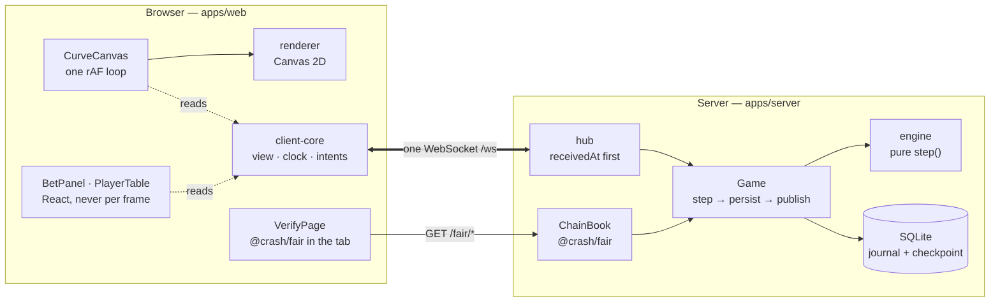
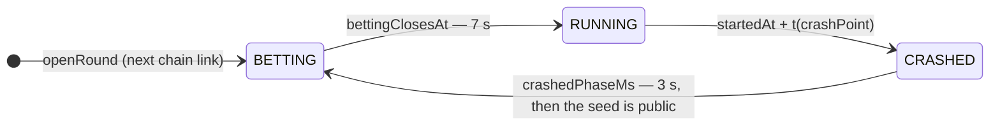

# Architecture

How one round reaches every screen at once. The detail lives in [`CLAUDE.md`](../CLAUDE.md), the
contract in [`protocol.md`](protocol.md), and the two decisions everything hangs on in
[ADR-0001](adr/ADR-0001-committed-crash-point.md) (the crash point is committed before the round)
and [ADR-0002](adr/ADR-0002-server-time-cashout.md) (a cash-out is worth the server's receive time).
This page is the map.

## The pieces



The same three packages run on both sides of the socket: `curve` (the multiplier as a function of
time), `fair` (the hash chain and the crash point) and `protocol` (every message as a schema). The
dependency rules that keep it that way are enforced in CI, not by convention.

## The round loop

The server owns the only clock that decides anything. `Game` keeps one timer — the next deadline the
pure engine reports — and every change goes the same way: **step** the engine (pure, so it commits to
nothing), **persist** the event and everything it implies in one SQLite transaction, then
**publish** the effects. Nothing reaches a socket that is not on disk, so a crash between the write
and the send replays to the same state.



- **The crash point is fixed before betting opens** — the next seed of a chain whose commit was
  published before the first round. No randomness runs during a round, so bets cannot influence it.
- **Every step first settles what was due**, at its scheduled moment: betting closes, auto
  cash-outs fire at exactly their target, the round busts. A late timer changes nothing.
- **A cash-out is stamped `receivedAt` on the first line of the frame handler**, before parsing, and
  is worth `m(receivedAt − startedAt)`. A press that arrives after the crash moment loses.

## The clock, and why the client draws its own curve

The multiplier is `m(t) = 100 · e^(0.15 · t)` in hundredths, a pure function of time since
`startedAt`. So the client does not need the server to tell it the multiplier — only *when the round
started*, and *how far its own clock is from the server's*.

```mermaid
sequenceDiagram
  participant S as Server
  participant C as client-core
  participant R as Canvas (rAF, 60–120 fps)
  C->>S: ping { clientTime: t0 }
  S-->>C: pong { clientTime: t0, serverTime: ts }
  Note over C: offset = ts − (t0 + t1)/2 from the fastest of 5 samples, rtt the median
  S->>C: roundStart { startedAt }
  loop every animation frame
    R->>C: serverNow() = now + offset
    Note over R: draw m(serverNow − startedAt)
  end
  S-->>C: tick { multiplier } — every 100 ms, only to catch drift
  S->>C: crash { crashPoint, seed }
  Note over R: freeze at crashPoint; the seed is now public
```

Why not just draw the ticks?

- **Ticks are 10 a second; screens are 60 to 120.** A client that redraws on each tick stutters.
- **A tick is already late by the one-way latency when it lands**, and arrives unevenly.
  Interpolating between late, uneven samples draws a curve that wobbles; evaluating `m` at
  `serverNow` draws the real one, smooth, at whatever rate the screen runs.
- **Reconnect becomes trivial.** A client that joins mid-round, or comes back after a dropped
  connection, needs `startedAt` from its `hello` and nothing else: there is no history to replay.

So ticks only check: if one lands more than a step off the local curve, the two sides disagree
about time or the curve, and the client resyncs rather than guess.

The cash-out button uses the same clock one step further: a press reaches the server half a round
trip later, so it shows `payout(stake, m(serverNow + rtt/2 − startedAt))` — what the press will most
likely be paid — and the result banner shows the promise beside what the server actually paid.

## When the network misbehaves

- **Loss on a WebSocket is lateness, never loss**: TCP resends and holds everything behind the gap.
  The client keeps drawing from its clock through a stall, and the next message catches it up.
- **A dead socket is noticed from both ends**: three missed pongs on the client, one missed
  protocol ping on the server.
- **Reconnect** is jittered exponential backoff, then `authenticate` with the stored token and a
  fresh `hello` that replaces the whole view. A request in flight (bet, cancel, cash-out) is an
  intent with one `betId`, resent until a reply — the server answers a repeat with the original
  reply, so nothing is placed or paid twice.

The [network lab](../apps/web/src/NetworkLab.tsx) on the live demo puts these faults on your own
socket, and P0 measured them on a crowd of 500 — see `CLAUDE.md` § Hardening.

## Deployment

One Docker image (`Dockerfile`): the server, serving the built web app from the same origin. The live
demo runs it on Render's free tier (`render.yaml`), which has no disk and sleeps when idle, so every
boot is a new table with a new chain under a new id ([ADR-0003](adr/ADR-0003-demo-host.md)). A host
with a disk mounts `/app/data` and the chain survives restarts as ADR-0001 intends.
